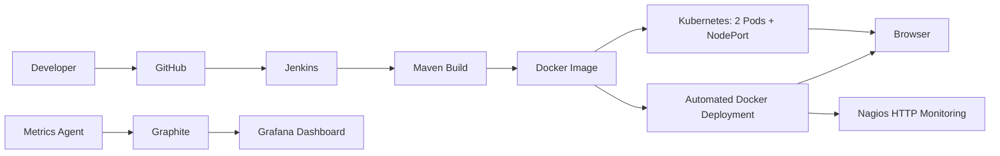

# Online Portfolio Website - DevOps Assignment 2

**Student:** Govardhan A R  
**Registration Number:** 23BCE1771  
**Selected use case:** Use Case 3 - Online Portfolio Website

This repository is a complete, assignment-ready DevOps implementation for a responsive portfolio website. It contains Maven packaging, a multi-stage Docker image, Jenkins CI/CD, Kubernetes Deployment and NodePort Service, Nagios availability monitoring, a Graphite metrics pipeline, and a provisioned Grafana dashboard.

## Architecture



## Repository structure

```text
.
├── src/main/resources/static/      # Portfolio HTML, CSS, JavaScript
├── pom.xml                          # Maven build
├── Dockerfile                       # Multi-stage Maven + Nginx image
├── Jenkinsfile                      # Build, image, deployment, health check
├── jenkins/                         # Ready-to-run local Jenkins container
├── k8s/deployment.yaml              # 2 replicas + NodePort Service
├── monitoring/
│   ├── docker-compose.yml           # App, Graphite, Grafana, Nagios, agent
│   ├── metrics-agent/               # Sends health and resource metrics
│   ├── grafana/                     # Provisioned datasource and dashboard
│   └── nagios/                      # Host and HTTP service checks
├── scripts/                         # Start/deploy/verify helpers
├── MANUAL_STEPS.md                  # Exact actions and screenshot guide
└── EVIDENCE_CHECKLIST.md            # Screenshot file names
```

## Fastest local test

```bash
./scripts/run-local.sh
```

Open `http://localhost:8080`.

## Full monitoring stack

Graphite and Nagios are pinned to the `linux/amd64` platform for compatibility through Docker Desktop emulation on Apple Silicon.

```bash
./scripts/start-monitoring.sh
```

| Component | URL | Credentials |
|---|---|---|
| Portfolio | `http://localhost:8080` | - |
| Grafana | `http://localhost:3000` | `admin` / `admin` |
| Graphite | `http://localhost:8081` | - |
| Nagios | `http://localhost:8082/nagios/` | `nagiosadmin` / `nagios` |
| Jenkins | `http://localhost:8085` | Created during setup |
| Jenkins-deployed app | `http://localhost:8090` | - |
| Kubernetes NodePort | `http://localhost:30080` | - |

## Kubernetes

```bash
./scripts/deploy-kubernetes.sh
```

The deployment creates two replicas and includes readiness/liveness probes on `/health`.

## Jenkins

```bash
docker compose -f jenkins/docker-compose.yml up --build -d
docker exec devops-jenkins cat /var/jenkins_home/secrets/initialAdminPassword
```

Create a Pipeline from SCM using this repository and `Jenkinsfile`. The pipeline polls Git every two minutes, runs Maven, builds the Docker image, replaces the existing deployment container, and verifies `/health`.

## Verify generated files without Docker

```bash
python scripts/verify-project.py
```

## Submission

Read **MANUAL_STEPS.md** and capture every item in **EVIDENCE_CHECKLIST.md**. Replace the screenshot placeholders in the provided report and export it to PDF.
